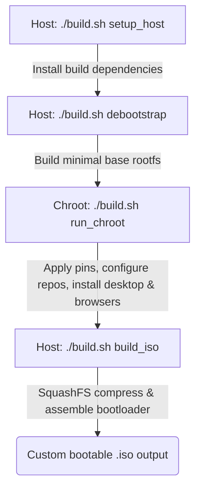

# Ubuntu Vanilla ISO Builder (No Snap)

Create a bootable Ubuntu live ISO from a minimal base, with a strict no-Snap policy (`snapd` is pinned with APT priority `-1`).

This project is designed for:
- **Beginners** who want a working custom Ubuntu ISO with simple commands and interactive prompts.
- **Advanced users** who want deterministic output, chroot-level control, tunable package profiles, and full customization capabilities.

---

## What's New

Recent improvements include:
- **Pop!_OS ISO Variant**: `scripts/build-popos.sh` builds a Pop!_OS ISO from the official Pop!_OS APT repositories (staging excluded) — see [Building Pop!_OS ISOs](#building-popos-isos). `start-here.sh` now asks which distro to build (Ubuntu or Pop!_OS).
- **Startup Mode Selection**: When run on a terminal without an explicit mode, `build.sh` first asks whether to build in **Basic** (default, guided prompts) or **Advanced** mode — an alternative to passing `--advanced`.
- **Build Hooks (Modloader)**: Drop `.sh` scripts into `scripts/hooks/pre-chroot/` and `scripts/hooks/chroot/` to customize the build — scripts run in sorted filename order, like a game modloader.
- **Advanced Mode**: `--advanced` flag preserves workspace on failure/Ctrl+C for faster re-runs, enables a persistent APT package cache to save bandwidth, and asks where to put the workspace (default `~/uvb-workspace`) and the finished ISO (default your home directory).
- **Tidy Paths**: In basic mode the workspace lives in a root-owned system directory (`/var/cache/ubuntu-vanilla-build/`) that stays out of your way — the same approach used on WSL — and the finished ISO is saved to your home directory (`/home/$USER`).
- **Config File Support** *(advanced mode)*: Load build options from a `build.cfg` file for repeatable builds (`--advanced --config=FILE`), or generate one with `--generate-config`. Basic mode uses interactive prompts.
- **Non-Interactive / Unattended Mode** *(advanced mode)*: `--advanced --no-interactive` disables all prompts; combined with `--locale` and `--keyboard-layout` for fully unattended builds.
- **Date+Time in ISO Name**: Generated ISOs include a UTC timestamp (e.g. `ubuntu-24.04-gnome-amd64-260703-041500.iso`) so old builds aren't overwritten.
- **Optional Pacstall**: Pacstall installation is configurable (`--pacstall` / `--no-pacstall`; installed by default).
- **Security Hardening**: Strict snapd blocking via APT pinning, signed keyrings for all third-party repositories, and optional package sets validated for installability before install.
- **Improved Error Handling**: Better error reporting and failure detection — no more silently swallowed failures, and invalid command ranges are rejected with a clear error.
- **Enhanced Desktop Support**: KDE Plasma, Cinnamon, Budgie, and LXDE with an automatic repair step in the installer.
- **Browser Flexibility**: Multiple browser options (Brave, LibreWolf, Firefox, Firefox ESR, Thunderbird) with configurable pre-installation.
- **Ubuntu Studio Integration**: Optional Ubuntu Studio package set for creative workloads.

---

## What This Build Produces

- **Bootable ISO**: A bootable ISO with GRUB for UEFI and BIOS.
- **Desktop choices**:
  - `gnome` (default, based on `vanilla-gnome-desktop`)
  - `xfce` (Xubuntu-like functional stack, without `xubuntu-*` branding packages; includes `labwc` for Wayland)
  - `lxde` (lightweight LXDE stack with `lightdm` and `slick-greeter`, for low-spec systems)
  - `lxqt` (LXQt via `lxqt` + `sddm` + `xorg`; no `lubuntu-desktop` / Lubuntu branding metapackages)
  - `mate` (`mate-desktop-environment` or lighter `mate-desktop-environment-core`, plus optional `mate-desktop-environment-extras`; `lightdm` + `slick-greeter`)
  - `cinnamon` (`cinnamon-desktop-environment` with `lightdm` and `slick-greeter`)
  - `budgie` (`budgie-desktop-environment` with `lightdm` and `slick-greeter`)
  - `kde-plasma` (KDE Plasma with selectable APT metapackage: `kde-full`, `kde-standard`, or `kde-plasma-desktop`)
- **Installer choices**:
  - `calamares` (default, all supported releases)
  - `ubiquity` (jammy only)
- **Browser repositories configured for**:
  - Brave (stable + Brave Origin, a minimalist privacy-focused build)
  - LibreWolf
  - Mozilla Firefox (`packages.mozilla.org` with pinning)
- **Optional pre-installs**: Brave channel, LibreWolf, Firefox, Firefox ESR, Thunderbird, and Ubuntu Studio package set.
- **Package Management Utilities**:
  - Pacstall installed by default through the official installer: [pacstall.dev](https://pacstall.dev) (disable with `--no-pacstall`).
  - Pre-configured Flatpak support with the Flathub repository (including the GNOME Software Flatpak plugin on GNOME desktop).
- **Outputs** (saved to your home directory by default — `UVB_OUTPUT_DIR` or the advanced-mode prompt picks another location; default name includes a UTC timestamp):
  - `${TARGET_NAME:-ubuntu-<version>-<desktop>-amd64-<yymmdd-hhmmss>}.iso`
  - `${TARGET_NAME:-ubuntu-<version>-<desktop>-amd64-<yymmdd-hhmmss>}.iso.sha1`
  - `${TARGET_NAME:-ubuntu-<version>-<desktop>-amd64-<yymmdd-hhmmss>}.iso.sha256`

---

## Supported Ubuntu Targets

Only these target releases are supported:

| Codename | Version | HWE Suffix |
| --- | --- | --- |
| `jammy` | 22.04 LTS | `-hwe-22.04` |
| `noble` | 24.04 LTS | `-hwe-24.04` |
| `resolute` | 26.04 LTS | `-hwe-26.04` |

*Note*: Use a host OS that is the same release as the target or newer.

---

## Building Pop!_OS ISOs

`scripts/build-popos.sh` is a Pop!_OS variant of `build.sh` with the same commands, options, and hooks. You can start it directly, or via `./start-here.sh --distro=popos` (without `--distro`, `start-here.sh` asks interactively).

### How it differs from the Ubuntu builder

- **Repositories**: everything comes from the CDN-backed `apt.pop-os.org` — debootstrap and the base system use the Ubuntu mirror (`https://apt.pop-os.org/ubuntu`), and the chroot additionally configures the `release`, `proprietary`, and `release-ubuntu` suites (falling back to `apt-origin.pop-os.org` per suite only when the CDN does not publish it) — all signed with the Pop!_OS archive keyring. Only the packages the build takes from Pop (`base-files`, `pop-*`, the System76 kernel/driver stack) are pinned (`o=pop-os-release`, priority 1001) — unlike stock Pop!_OS's repo-wide pin, so the standard Ubuntu desktops this builder installs keep resolving against the Ubuntu archive. **Staging repositories are deliberately excluded.**
- **Releases**: same three LTS targets — `jammy` (22.04), `noble` (24.04), and `resolute` (26.04, released early July 2026).
- **Kernel choice**: `--kernel=system76|generic|lowlatency`. The default `system76` installs `linux-system76` from the Pop!_OS repos (tracks the stable Linux branch); `generic`/`lowlatency` keep the stock Ubuntu HWE kernels.
- **Bootloader**: official Pop!_OS media use systemd-boot, which expects a large (>= 1 GiB) EFI System Partition. This builder keeps **GRUB** (hybrid BIOS + UEFI), so no oversized ESP is required.
- **System76 hardware driver (optional)**: `--system76-driver` (or `TARGET_SYSTEM76_DRIVER=1`) pre-installs `system76-driver` from the Pop!_OS repos for System76 machines (fan/keyboard/suspend support). Default is off — the repos stay configured, so it can always be installed later with `sudo apt install system76-driver`.
- **Calamares config**: comes from `scripts/calamares-popos/` (Pop!_OS branding); the module set matches `scripts/calamares/`.
- **Separate workspace/cache/config**: uses a `workspace-popos/` subdirectory (under the same workspace parent as Ubuntu builds), its own APT cache, and `scripts/build-popos.cfg`, so Ubuntu and Pop!_OS builds never collide.

### Desktop note: no pop-desktop / COSMIC option

The desktop choices are the same as the Ubuntu builder (GNOME default, XFCE, KDE Plasma, MATE, Cinnamon, Budgie, LXDE, LXQt). Pop's own desktops — `pop-desktop` and COSMIC — are **intentionally not offered**, because COSMIC still has too many bugs when installed through Calamares.

### Installing COSMIC after installation (noble / resolute)

The installed system already has the Pop!_OS repositories configured, so users who installed from this ISO can add COSMIC themselves:

```bash
sudo apt update
sudo apt install cosmic-session
```

Then log out and pick the **COSMIC** session from the session menu on the login screen. For the full Pop!_OS desktop stack instead, install `pop-desktop`. (The build also prints this note at the end of every noble/resolute Pop!_OS build.)

---

## Build Concepts

Understanding the build pipeline helps with troubleshooting and customization:

- **Host system**: The machine where you run `scripts/build.sh` (your current Ubuntu/Debian system).
- **Live system**: The rootfs built inside a chroot environment and packed into the ISO (what you boot from the USB).
- **Target system**: The final installed OS after running the installer from the live media.

### Build Pipeline Flow
The build process follows these stages:

1. **Host Setup**: Install required tools (`debootstrap`, `squashfs-tools`, `xorriso`) and prepare workspace.
2. **Debootstrap**: Create a minimal Ubuntu base system using the chosen release and mirror.
3. **Chroot Configuration**: Enter the chroot environment to:
   - Configure APT sources and pinning (including snapd blocking).
   - Install desktop environment and selected packages.
   - Configure browser repositories (Brave, LibreWolf, Firefox).
   - Install Pacstall and optional extras (Ubuntu Studio, etc.).
4. **Live Image Assembly**: Create the live filesystem structure with Casper integration.
5. **SquashFS + ISO Creation**: Compress the filesystem and generate the bootable ISO with GRUB.



### Security Features
- **Snapd Blocking**: APT pinning prevents snapd installation (Pin-Priority: -1) to block snap installations system-wide.
- **Package Availability Checks**: Optional package sets (e.g. Ubuntu Studio) are checked for installability and hidden snapd dependencies before installation.
- **Signed Repositories**: Third-party APT sources (Brave, LibreWolf, Mozilla) are configured with their vendor signing keyrings; Memtest86+ is downloaded with a pinned SHA-256 checksum.
- **Network Security**: Package and installer downloads use HTTPS.

---

## Requirements

### System Requirements
- **Host OS**: Ubuntu/Debian or derivative (automatically validated by the script).
- **Internet Access**: Required for downloading packages from Ubuntu and third-party repositories.
- **Disk Space**: Minimum 15-20 GB free space for debootstrap, squashfs, and ISO generation.
- **RAM**: 4 GB minimum (8 GB recommended for smoother builds).
- **Permissions**: `sudo` access. Both build scripts (and `start-here.sh`) validate sudo once up front and keep the credentials alive in the background, so you are not re-prompted for a password mid-build.

### Host OS Compatibility
The script supports building on:
- Ubuntu 22.04+ (jammy, noble, resolute)
- Debian 11+ (requires `ubuntu-archive-keyring` package)
- Ubuntu/Debian derivatives (Mint, Pop!_OS, etc.)

---

## Quick Start (Beginner Friendly)

### Getting Started in 3 Steps

1. **Clone this repository**:
   ```bash
   git clone <repository-url>
   cd ubuntu-vanilla-build
   ```

2. **Run the build script**:
   ```bash
   # Method 1: Using the convenience script from repository root
   # (asks whether to build Ubuntu or Pop!_OS; or pass --distro=ubuntu|popos)
   ./start-here.sh -

   # Method 2: Directly from scripts directory
   cd scripts/
   ./build.sh -          # Ubuntu ISO
   ./build-popos.sh -    # Pop!_OS ISO
   ```

3. **Follow the interactive wizard**:
   On a terminal (TTY), the script first asks which mode to use — press **Enter for Basic** — then prompts you step-by-step for the configuration.

---

## Interactive Prompts

The script is interactive by default on a TTY when required values are missing. The prompt wizard guides you through choosing:

- **Build mode**: Basic (default) or Advanced — asked first, unless `--advanced` or `ADVANCED_MODE` was given
- **Release**: `jammy`, `noble`, or `resolute`
- **Installer**: `calamares` or `ubiquity` (Ubiquity is validated for jammy only)
- **Kernel flavor**: `generic` or `lowlatency`
- **Desktop**: `gnome`, `xfce`, `lxde`, `lxqt`, `mate`, `cinnamon`, `budgie`, or `kde-plasma`
- **KDE package tier** (when desktop is `kde-plasma`): `kde-standard`, `kde-plasma-desktop`, or `kde-full`
- **MATE metapackage** (when desktop is `mate`): `mate-desktop-environment` or `mate-desktop-environment-core`, plus optional MATE extras
- **GNOME recommends toggle** (GNOME only): Enable/disable recommends for GNOME
- **Brave channel**: `release` (default), `origin`, or `none`
- **LibreWolf pre-install toggle**
- **Firefox**: release, ESR, or skip (default: skip)
- **Thunderbird pre-install toggle**
- **Ubuntu Studio package set toggle**
- **Pacstall toggle** (default: install)

Prompt defaults match the non-interactive fallbacks below, so pressing Enter everywhere yields the same ISO as an unattended run.

### Default Settings
If values are not explicitly set and interactive prompts are skipped, the default fallback settings are:
- **Installer**: `calamares`
- **Desktop**: `gnome`
- **Brave channel**: `release`
- **LibreWolf**: Disabled
- **Firefox / Firefox ESR**: Disabled
- **Thunderbird**: Disabled
- **Ubuntu Studio**: Disabled
- **GNOME Recommends**: Disabled
- **Pacstall**: Enabled

---

## Command-Line Options

### Basic Options
- `--release=jammy|noble|resolute` - Target Ubuntu release.
- `--mirror=URL` - Ubuntu package mirror (default: `https://archive.ubuntu.com/ubuntu/`).
- `--kernel=generic|lowlatency` - Kernel flavor.
- `--installer=calamares|ubiquity` - Installer type.
- `--desktop=<desktop>` - Desktop environment slug.

### Desktop-Specific Options
- `--kde=kde-full|kde-standard|kde-plasma-desktop` - KDE package tier.
  - `kde-plasma-desktop`: Minimal Plasma desktop.
  - `kde-standard`: Standard Plasma with common applications (default).
  - `kde-full`: Complete KDE suite with all applications.
- `--mate=full|core` - MATE metapackage choice.
  - `full`: Complete MATE desktop (default).
  - `core`: Lightweight MATE core.
- `--mate-extras` / `--no-mate-extras` - Add MATE extras package.

### Browser Options
- `--brave=none|release|origin` - Brave browser channel.
  - `release`: Stable Brave browser (default).
  - `origin`: Brave Origin — a minimalist, privacy-focused Brave build without the extra integrated features.
  - `none`: Skip Brave pre-installation (repo is still configured).
- `--librewolf` / `--no-librewolf` - Pre-install LibreWolf browser.
- `--firefox` / `--no-firefox` - Pre-install Firefox from Mozilla APT.
- `--firefox-esr` / `--no-firefox-esr` - Pre-install Firefox ESR from Mozilla PPA.
- `--thunderbird` / `--no-thunderbird` - Pre-install Thunderbird from Mozilla PPA.

*Note*: Browser repositories are always configured regardless of pre-installation choice, allowing you to easily `apt install` them post-install.

### Additional Options
- `--ubuntu-studio` / `--no-ubuntu-studio` - Include Ubuntu Studio creative packages.
- `--pacstall` / `--no-pacstall` - Install Pacstall package manager (default: yes).
- `--browser=release|origin` - Legacy alias for Brave selection (use `--brave` instead).

### Locale & Keyboard (Unattended Builds)
- `--locale=LOCALE` - System locale (e.g. `en_US.UTF-8`) to pre-seed for non-interactive locale configuration.
- `--keyboard-layout=LAYOUT` - Keyboard layout code (e.g. `us`, `de`, `fr`).
- `--keyboard-variant=VARIANT` - Keyboard variant (e.g. `intl`, `nodeadkeys`; optional).

### Config File & Interactive Mode
- `--config=FILE` - Load build options from a config file (KEY=VALUE format; **requires `--advanced`**). If not specified, `scripts/build.cfg` is loaded automatically when present in advanced mode.
- `--generate-config` - Launch an interactive wizard to generate a `build.cfg` file (advanced mode). Also available from the repository root as `./start-here.sh --create-config` (or `--generate-config`), which first asks which builder (Ubuntu or Pop!_OS) to generate the config for, then forwards `--generate-config` to it — no sudo or host dependencies needed for this shortcut.
- `--interactive` - Force interactive prompts even when stdin is not a TTY (**requires `--advanced`**).
- `--no-interactive` - Disable all interactive prompts; missing required values use defaults or cause an error (**requires `--advanced`**).

> **Note:** In basic mode (default), the build uses interactive prompts and sensible defaults — prompts appear whenever a terminal is attached, no flags needed. Config files and the `--interactive`/`--no-interactive` overrides are advanced-mode features for power users and CI pipelines. When you run `build.sh` on a terminal without choosing a mode, it first asks whether to run in Basic or Advanced mode (an alternative to passing `--advanced`).

### Build Hooks (Modloader)

Drop executable `.sh` scripts into the hooks directories to customize the build pipeline — like a game modloader:

```
scripts/hooks/
  pre-chroot/    # Runs on host after debootstrap, before entering chroot
  chroot/        # Runs inside chroot after packages are installed
```

Scripts are discovered and executed in **sorted filename order**. Use numeric prefixes to control load order:

```bash
hooks/pre-chroot/00-copy-skel-files.sh
hooks/pre-chroot/10-add-custom-repo.sh
hooks/chroot/00-install-extra-packages.sh
hooks/chroot/50-configure-services.sh
```

- Each hook receives all `TARGET_*` environment variables.
- Pre-chroot hooks also get `WORKSPACE_CHROOT` (path to the chroot root on the host).
- A failing hook aborts the build; use `|| true` for optional operations.
- `--hooks-dir=PATH` overrides the default `scripts/hooks/` directory.

See `scripts/hooks/README.md` for detailed documentation and examples.

### Advanced Mode

`--advanced` (or `ADVANCED_MODE=1` as an environment variable) unlocks features for power users:

1. **Config file support**: Auto-loads `scripts/build.cfg` if present, or use `--config=FILE` for a custom path. Generate one interactively with `--generate-config`. In basic mode (default), the build relies on interactive prompts instead.
2. **Workspace preservation**: On Ctrl+C or build failure, only bind mounts are unmounted — the workspace tree is kept intact. This lets you inspect or resume from a specific build stage (e.g. `./build.sh --advanced run_chroot`) without re-running debootstrap.
3. **Package cache**: A persistent APT cache directory (`~/.cache/ubuntu-vanilla-build/apt-cache/`) is bind-mounted into the chroot. Downloaded `.deb` files survive across builds, saving bandwidth on repeated builds.
4. **Workspace reuse**: `setup_host` reuses an existing workspace directory instead of cleaning it, allowing faster iteration.

---

## Advanced Execution Syntax

For developers who want to control specific build stages:
```bash
./build.sh [options] [start_cmd] [-] [end_cmd]
```

Host commands (run outside chroot):
- `setup_host` - Install host dependencies and prepare workspace.
- `debootstrap` - Create the minimal base rootfs.
- `run_chroot` - Execute the chroot build stages.
- `build_iso` - Create SquashFS and generate bootable ISO.

Examples:
- `./build.sh -` - Run the entire pipeline (default).
- `./build.sh setup_host` - Only run host setup.
- `./build.sh setup_host - debootstrap` - Run from setup_host through debootstrap.
- `./build.sh debootstrap - build_iso` - Run from debootstrap through ISO creation.

---

## Environment Variables

For advanced configurations, environment variables can be used instead of CLI flags:

### Core Build Variables
- `TARGET_UBUNTU_VERSION` - Ubuntu release codename (`jammy`, `noble`, `resolute`).
- `TARGET_UBUNTU_MIRROR` - Package mirror URL.
- `TARGET_KERNEL_FLAVOR` - Kernel type (`generic`, `lowlatency`).
- `TARGET_KERNEL_PACKAGE` - Override kernel metapackage name directly.
- `TARGET_INSTALLER` - Installer type (`calamares`, `ubiquity`).
- `TARGET_DESKTOP` - Desktop environment slug.

### Desktop-Specific Variables
- `TARGET_KDE_PACKAGE` - KDE metapackage when using kde-plasma.
- `TARGET_MATE_PACKAGE` - MATE metapackage.
- `TARGET_MATE_EXTRAS` - Set to `1` to install MATE extras.

### Browser Variables
- `TARGET_BRAVE_CHANNEL` - Brave channel (`none`, `release`, `origin`).
- `TARGET_BROWSER` - Legacy alias for Brave (use `TARGET_BRAVE_CHANNEL`).
- `TARGET_LIBREWOLF` - Set to `1` to pre-install LibreWolf.
- `TARGET_FIREFOX` - Set to `1` to pre-install Firefox.
- `TARGET_FIREFOX_ESR` - Set to `1` to pre-install Firefox ESR.
- `TARGET_FIREFOX_POPOS` - Set to `1` to pre-install Firefox from the Pop!_OS repository (`build-popos.sh` only). This is the native deb System76 builds from Mozilla source ([pop-os/packaging-firefox](https://github.com/pop-os/packaging-firefox)) — a real browser, not Ubuntu's snap-transition stub; the build verifies the candidate comes from the Pop!_OS repos, is larger than 10 MB, and has no snapd dependency before installing. Mutually exclusive with `TARGET_FIREFOX`.
- `TARGET_THUNDERBIRD` - Set to `1` to pre-install Thunderbird.

### Feature & Customization Variables
- `TARGET_UBUNTU_STUDIO` - Set to `1` to include Ubuntu Studio packages.
- `TARGET_GNOME_INSTALL_RECOMMENDS` - Set to `1` to install GNOME with recommends.
- `TARGET_PACSTALL` - Set to `0` to skip Pacstall installation (default: `1`).
- `TARGET_PACKAGE_REMOVE` - Space-separated list of packages to remove from target system.
- `TARGET_NAME` - Custom output ISO base name (includes UTC timestamp by default).
- `GRUB_LIVEBOOT_LABEL` - Custom boot menu entry label.
- `UBUNTU_VANILLA_WORKSPACE` - Custom workspace parent directory (overrides the mode defaults: `/var/cache/ubuntu-vanilla-build` in basic mode, `~/uvb-workspace` in advanced mode).
- `UVB_OUTPUT_DIR` - Directory where the finished ISO and checksums are placed (default: your home directory).

### Locale & Keyboard Variables
- `TARGET_LOCALE` - System locale for unattended builds (e.g. `en_US.UTF-8`).
- `TARGET_KEYBOARD_LAYOUT` - Keyboard layout code (e.g. `us`, `de`).
- `TARGET_KEYBOARD_VARIANT` - Keyboard variant (optional, e.g. `intl`).

### Config & Interactive Variables
- `INTERACTIVE` - Set to `0` to disable interactive prompts (equivalent to `--no-interactive`; advanced mode only).
- `NO_CONFIRM` - Set to `1` to skip the pre-build confirmation prompt.
- `NO_COLOR` - Set (to any value) to disable colored terminal output; colors are also disabled automatically when stdout is not a TTY or `TERM=dumb`.

### Advanced Mode Variables
- `ADVANCED_MODE` - Set to `1` to preserve workspace on failure/interrupt and enable package cache.
- `HOOKS_DIR` - Custom path to the hooks directory (default: `scripts/hooks/`).

---

## Common Examples

```bash
# Jammy + generic kernel + defaults
./build.sh --release=jammy --kernel=generic -

# Jammy + Ubiquity installer (jammy only)
./build.sh --release=jammy --kernel=generic --installer=ubiquity -

# Jammy + Calamares + XFCE
./build.sh --release=jammy --kernel=generic --installer=calamares --desktop=xfce -

# Jammy + Calamares + LXDE (lightweight desktop)
./build.sh --release=jammy --kernel=generic --installer=calamares --desktop=lxde -

# Jammy + Calamares + LXQt (SDDM, no Lubuntu branding stack)
./build.sh --release=jammy --kernel=generic --installer=calamares --desktop=lxqt -

# Jammy + Calamares + MATE
./build.sh --release=jammy --kernel=generic --installer=calamares --desktop=mate -

# Jammy + MATE core + extras (non-interactive)
./build.sh --release=jammy --kernel=generic --desktop=mate --mate=core --mate-extras -

# Jammy + Calamares + Cinnamon
./build.sh --release=jammy --kernel=generic --installer=calamares --desktop=cinnamon -

# Jammy + Calamares + Budgie
./build.sh --release=jammy --kernel=generic --installer=calamares --desktop=budgie -

# Jammy + KDE Plasma desktop using the standard package set
./build.sh --release=jammy --kernel=generic --desktop=kde-plasma --kde=kde-standard -

# Noble + KDE Plasma desktop with full KDE package set
./build.sh --release=noble --kernel=generic --desktop=kde-plasma --kde=kde-full -

# Resolute + KDE Plasma desktop with minimal package set
./build.sh --release=resolute --kernel=generic --desktop=kde-plasma --kde=kde-plasma-desktop -

# Jammy + GNOME + LibreWolf and Firefox preinstalled
./build.sh --release=jammy --kernel=generic --desktop=gnome --librewolf --firefox -

# Noble + XFCE + lowlatency kernel
./build.sh --release=noble --kernel=lowlatency --desktop=xfce -

# Noble + GNOME + Brave Origin preinstalled
./build.sh --release=noble --kernel=generic --desktop=gnome --brave=origin -

# Noble + no Brave, but preinstall Firefox
./build.sh --release=noble --kernel=generic --brave=none --firefox -

# Noble + GNOME with recommends enabled
TARGET_GNOME_INSTALL_RECOMMENDS=1 ./build.sh --release=noble --kernel=generic --desktop=gnome -

# Noble + GNOME + Ubuntu Studio extras
./build.sh --release=noble --kernel=generic --desktop=gnome --ubuntu-studio -

# Noble + custom mirror
./build.sh --release=noble --kernel=generic --mirror=http://archive.ubuntu.com/ubuntu/ -

# Resolute + generic kernel + defaults
./build.sh --release=resolute --kernel=generic -

# Resolute + XFCE + lowlatency kernel
./build.sh --release=resolute --kernel=lowlatency --desktop=xfce -

# Resolute + GNOME + Brave skipped + LibreWolf preinstalled
./build.sh --release=resolute --kernel=generic --desktop=gnome --brave=none --librewolf -

# Resolute + GNOME + Brave Origin + Firefox preinstalled
./build.sh --release=resolute --kernel=generic --desktop=gnome --brave=origin --firefox -

# Resolute + GNOME with recommends enabled
TARGET_GNOME_INSTALL_RECOMMENDS=1 ./build.sh --release=resolute --kernel=generic --desktop=gnome -

# Advanced mode: generate a config file with the wizard
./build.sh --generate-config
# ...or from the repository root (asks Ubuntu or Pop!_OS first):
# ./start-here.sh --create-config

# Advanced mode: build using a config file
./build.sh --advanced --config=build.cfg -

# Advanced mode: preserve workspace for faster re-runs
./build.sh --advanced --release=noble --kernel=generic -
```

---

## Workspace and Output Behavior

### Workspace Directory
The build process uses a workspace directory to store temporary files:
- **Basic mode location**: `/var/cache/ubuntu-vanilla-build/workspace/` — a root-owned system directory kept out of the user's way (contains `chroot/` and `image/` subdirectories during build). Because it always lives on a Linux-native filesystem, WSL `/mnt/c` unpack issues can't occur.
- **Advanced mode location**: you are asked interactively where to put the workspace (default: `~/uvb-workspace`; the actual workspace becomes `<answer>/workspace`). Non-interactive advanced runs use the default silently.
- **Custom location (any mode)**: Set `UBUNTU_VANILLA_WORKSPACE=/some/path` to use a custom parent directory (actual workspace becomes `/some/path/workspace`) and skip the prompt.
- **WSL guard**: If the chosen workspace path lands on a Windows-backed mount (`/mnt/...`, `/media/...`, 9p/DrvFs), it is automatically relocated to the system directory above, because debootstrap cannot unpack reliably there.
- **Automatic cleanup**: On successful build, the workspace is automatically removed to save disk space. In basic mode, a failed or interrupted (Ctrl+C) build also unmounts the chroot bind mounts and removes the workspace automatically — no manual cleanup needed.
- **Advanced mode preservation**: With `--advanced`, the workspace is preserved on failure or Ctrl+C (only bind mounts are unmounted). This enables faster re-runs: debootstrap is skipped automatically when the chroot already exists, so you can jump straight to the failed stage.

### Output Files
After a successful build, the following files are placed in your home directory (`/home/$USER`) by default. In advanced mode you are asked interactively where to put them (default: your home directory), and `UVB_OUTPUT_DIR=/some/path` overrides the location in any mode. Files are chowned back to the invoking user, and the default name carries a UTC timestamp so repeat builds never overwrite each other:
- `${TARGET_NAME:-ubuntu-<version>-<desktop>-amd64-<yymmdd-hhmmss>}.iso` - The bootable ISO image.
- `${TARGET_NAME:-ubuntu-<version>-<desktop>-amd64-<yymmdd-hhmmss>}.iso.sha1` - SHA-1 checksum for verification.
- `${TARGET_NAME:-ubuntu-<version>-<desktop>-amd64-<yymmdd-hhmmss>}.iso.sha256` - SHA-256 checksum for verification.

---

## Package and Policy Details

### Core Policies
- **No Snap Policy**: `snapd` is blocked via APT pinning (`Pin-Priority: -1`) to ensure a snap-free Ubuntu experience.
- **Package Availability Checks**: Optional package sets (e.g. Ubuntu Studio) are checked for availability, installability, and hidden snapd dependencies before installation; unavailable ones are skipped with a log message.
- **Browser Repositories**: Brave, LibreWolf, and Firefox repositories are always configured (even if browsers aren't pre-installed).

### Calamares Installer Configuration
The build uses Calamares configuration from `scripts/calamares/`. Edit YAML files in this directory to modify installer flow, partitioning defaults, welcome screen, locale behavior, and post-install package removals.

### Desktop Environment Profiles
Each desktop environment has a carefully curated package set:
- **GNOME**: Uses `vanilla-gnome-desktop` with optional recommends (lighter by default).
- **XFCE**: Xubuntu-equivalent stack without `xubuntu-*` branding packages; includes `labwc` for Wayland sessions.
- **LXDE**: Lightweight stack with `lxde`, `xorg`, `lightdm`, and `slick-greeter` for low-spec systems.
- **LXQt**: Upstream-style stack with `lxqt`, `sddm`, and `xorg` (no Lubuntu branding).
- **MATE**: Full or core MATE desktop with `xorg`, `lightdm`, and `slick-greeter`; optional extras available.
- **Cinnamon**: Full Cinnamon desktop with `xorg`, `lightdm`, and `slick-greeter`.
- **Budgie**: Full Budgie desktop with `xorg`, `lightdm`, and `slick-greeter`.
- **KDE Plasma**: Selectable tier (`kde-plasma-desktop`, `kde-standard`, or `kde-full`).

### Special Features
- **Pacstall**: Installed by default via the official script from [pacstall.dev](https://pacstall.dev); disable with `--no-pacstall` or `TARGET_PACSTALL=0`.
- **Flatpak**: Pre-configured with Flathub repository; GNOME Software plugin included for GNOME desktop.
- **Ubuntu Studio**: Optional creative package set (audio, graphics, photography, publishing, video); unavailable dependencies are automatically skipped with logging.
- **Kernel Management**: HWE metapackages automatically selected based on release and kernel flavor (unless overridden with `TARGET_KERNEL_PACKAGE`).

### LXDE Repair Mechanism
For LXDE builds, Calamares includes an automatic repair step:
- Triggers when the installed system shows only Openbox instead of LXDE session.
- Runs `apt-get update && apt-get install --no-install-recommends lxde` in the target root.
- **Requires internet connection during installation** to access package mirrors.
- Offline installs skip this step (see troubleshooting section for manual fix).

---

## Verifying Build Artifacts

After building, verify the integrity of your ISO using the provided checksum files (replace the name with your actual timestamped ISO):
```bash
cd scripts/
sha256sum -c ubuntu-24.04-gnome-amd64-<yymmdd-hhmmss>.iso.sha256
sha1sum -c ubuntu-24.04-gnome-amd64-<yymmdd-hhmmss>.iso.sha1
```

### Testing the ISO
Before deploying, test your ISO in a virtual machine:
- **VirtualBox**: Create a new VM, attach the ISO as optical drive, boot and test live session and installation.
- **QEMU/KVM**: Use `qemu-system-x86_64 -cdrom <your-iso-file>.iso -m 4096 -enable-kvm`
- **VMware**: Create a new VM, attach ISO, and test the installation process.

### Creating Bootable USB
Use a tool like `dd`, `balenaEtcher`, or `Rufus` (Windows) to create a bootable USB:
```bash
# Using dd (Linux/macOS)
sudo dd if=<your-iso-file>.iso of=/dev/sdX bs=4M status=progress conv=fsync
```
> [!WARNING]
> Replace `/dev/sdX` with your actual USB device (use `lsblk` to identify). Writing to the wrong device will result in data loss.

---

## Troubleshooting

### Common Issues
- **No interactive prompts in CI/non-TTY environments**: Provide all required options explicitly (`--release`, `--kernel`, and any toggles).
- **Ubiquity installer rejected**: Use `--installer=ubiquity` only with `--release=jammy` (22.04 LTS).
- **Debian host keyring error**: Install `ubuntu-archive-keyring` package: `sudo apt install ubuntu-archive-keyring`
- **Build fails on WSL Windows mount**: The workspace always defaults to a Linux-native path now; if you point `UBUNTU_VANILLA_WORKSPACE` (or the advanced-mode prompt) at `/mnt/...`, it is relocated automatically to `/var/cache/ubuntu-vanilla-build`.
- **Missing package in chosen release**: Script logs and skips unavailable/uninstallable packages with warnings.
- **LXDE installed system shows only Openbox**: Connect to internet during Calamares installation so the LXDE repair step can reach mirrors, or manually fix after boot (see below).

### LXDE Openbox-Only Issue
If you install an LXDE ISO while offline and the system boots to Openbox only:

**After you get internet:**
1. Boot into the installed system and select the Openbox session.
2. Open a terminal and run:
   ```bash
   sudo apt update
   sudo apt install --no-install-recommends lxde
   ```
3. Log out or reboot.
4. At the login screen, select **LXDE Session**, then log in.

**Panel configuration fix:**
If the taskbar/panel looks wrong or missing:
- Right-click the LXDE panel → Edit Panel → Panel Preferences.
- Remove the **Desktop Pager** and **Desktop Spacer** applets.

### Advanced Debugging
For detailed debugging, you can run individual build stages:
```bash
# Run only host setup to check dependencies
./build.sh setup_host

# Run debootstrap stage to check base system creation
./build.sh debootstrap

# Run chroot stage to check package installation
./build.sh run_chroot
```

---

## Advanced Customization

### Modifying Calamares Configuration
For deep customization of the installer experience, edit the YAML files in `scripts/calamares/`:
- `settings.conf` - Main Calamares configuration and module sequence.
- `modules/` - Individual module configurations (partitioning, users, packages, etc.).
- `branding/` - Visual branding and slideshow content.
- `i18n/SUPPORTED` - Supported locales.

### Adding Custom Packages
The recommended way to add custom packages is with **build hooks** (see [Build Hooks](#build-hooks-modloader)). Drop a script into `scripts/hooks/chroot/` that runs `apt-get install -y <your-packages>` — no need to modify `build.sh` at all.

Alternatively, for permanent changes to the build pipeline itself, modify the `customize_image()` function in `scripts/build.sh`. Look for the desktop-specific sections and add your packages to the appropriate `apt-get install` commands.

### Creating Custom Desktop Profiles
To add a new desktop environment variant:
1. Add the desktop name to the validation in `normalize_desktop_variant()`.
2. Add installation logic in the `customize_image()` function under a new case statement.
3. Update the help text in `host_help()` to document the new option.

---

## Contributing

Contributions are welcome! Areas for contribution:
- Additional desktop environment profiles.
- Package selection optimizations.
- Documentation improvements.
- Bug fixes and error handling enhancements.

---

## License

Licensed under **GNU General Public License v2.0**. See `LICENSE`.
